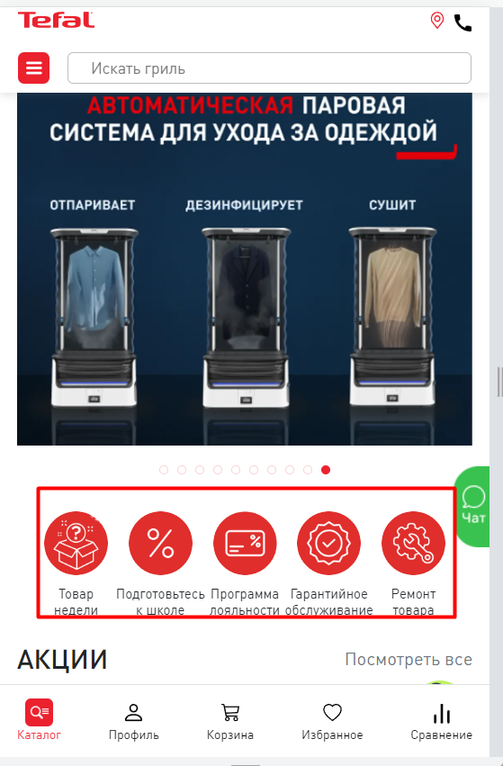

[Вернуться на главную](/README.md)

# **Карта рекомендованных событий электронная торговля**

<table>
	<tr>
        <th class="col1">№</th>
        <th class="col2">Событие</th>
        <th class="col3">Триггер (сценарий)</th>
        <th class="col4">Пример кода dataLayer</th>
        <th class="col5">Список страниц</th>
        <th class="col6">Место на странице </th>
        <th class="col7">Пример</th> 
    </tr>
    <!-- 1 Показ товаров -->
<!-- -->
    <tr>
        <td rowspan=15>1</td>
        <td rowspan=15>Показ товаров</td>
        <td rowspan=15>Появление миниатюры карточек товаров в видимой части экрана</td>
        <td rowspan=15><a href="../../02_datalayer_settings/01_events/01_eccomerce_events/01_showImpressionsProduct.md" target="_blank">01_showImpressionsProduct.md<a></td>
        <td rowspan=5>
            <li>Истории</li>
        </td>
        <td>Виджет Frisbuy stories</td>
        <td> Истории</td>
    </tr>
    <!-- 2 Клик по карточке товара -->
<!-- --> 
    <tr>
        <td rowspan=15>2</td>
        <td rowspan=15>Клик по карточке товара</td>
        <td rowspan=15>Кликнул по миниатюре карточки товара</td>
        <td rowspan=15><a href="../../02_datalayer_settings/01_events/01_eccomerce_events/02_clickProductDetail.md" target="_blank">02_clickProductDetail.md</a></td>
        <td rowspan=5>
            <li>Истории</li>
        </td>
    </tr>
<!-- -->
    <tr>
        <td>
            <li>Истории</li>
        </td>
        <td>Виджет Frisbuy stories</td>
        <td> Истории</td>
    </tr>
        <!-- 3 Клик по истории-->
        <tr>
        <td rowspan=15>3</td>
        <td rowspan=15>Клик по истории</td>
        <td rowspan=15>Кликнул по истории</td>
        <td rowspan=15><a href="../../02_datalayer_settings/01_events/01_eccomerce_events/03_clickStory.md" target="_blank">03_clickStory.md</a></td>
        <td rowspan=5>
            <li>Главная</li>
        </td>
<!-- -->
    <tr>
        <td>
            <li>Главная</li>
        </td>
        <td>Виджет Frisbuy stories</td>
        <td> Истории</td>
    </tr>
       <!-- 4 Показ по истории-->
        <tr>
        <td rowspan=15>3</td>
        <td rowspan=15>Показ истории</td>
        <td rowspan=15>Появление истории на экране</td>
        <td rowspan=15><a href="../../02_datalayer_settings/01_events/01_eccomerce_events/03_showStory.md" target="_blank">03_showStory.md</a></td>
        <td rowspan=5>
            <li>Главная</li>
        </td>
<!-- -->
    <tr>
        <td>
            <li>Главная</li>
        </td>
        <td>Виджет Frisbuy stories</td>
        <td> Истории</td>
    </tr>
    <!-- 5 Показ по истории-->
        <tr>
        <td rowspan=15>3</td>
        <td rowspan=15>Клик по ссылке</td>
        <td rowspan=15>Кликнул по ссылке в истории</td>
        <td rowspan=15><a href="../../02_datalayer_settings/01_events/01_eccomerce_events/03_showStory.md" target="_blank">03_showStory.md</a></td>
        <td rowspan=5>
            <li>История</li>
        </td>
<!-- -->
    <tr>
        <td>
            <li>История</li>
        </td>
        <td>Виджет Frisbuy stories</td>
        <td> Истории</td>
    </tr>
</table>  

