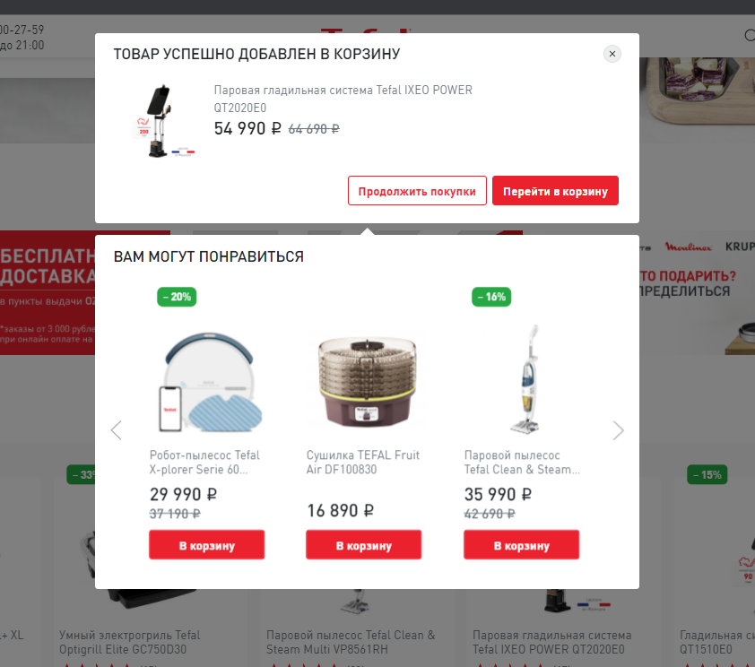
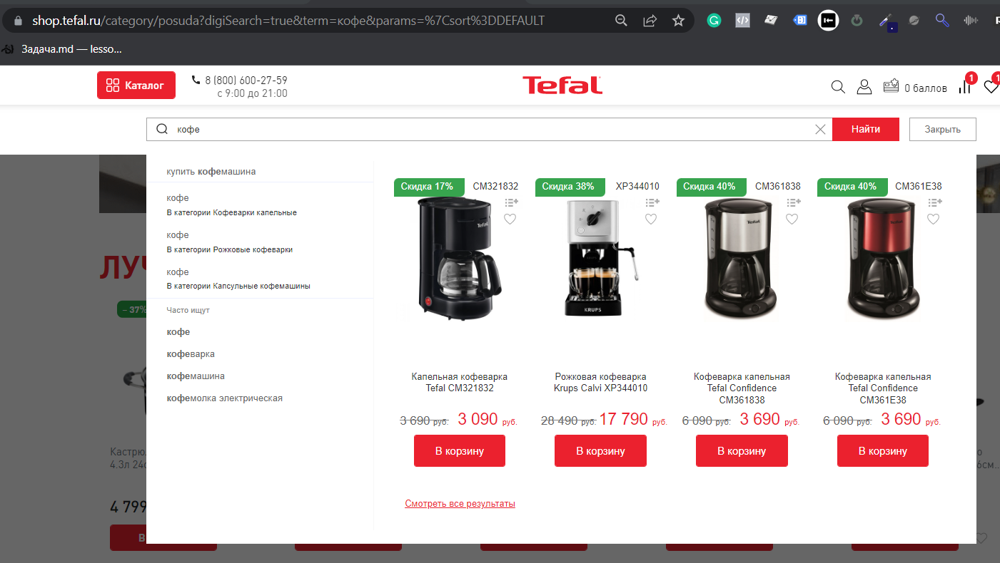
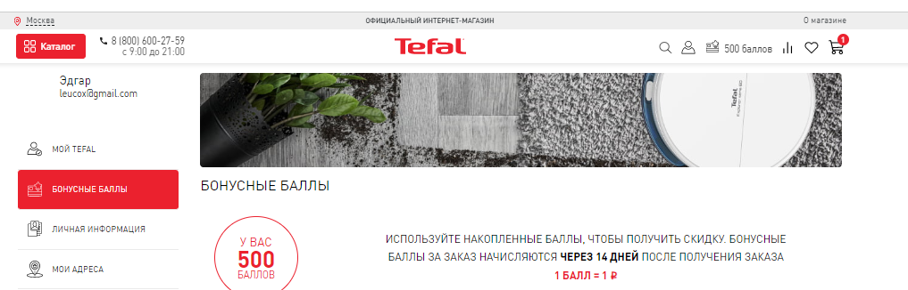
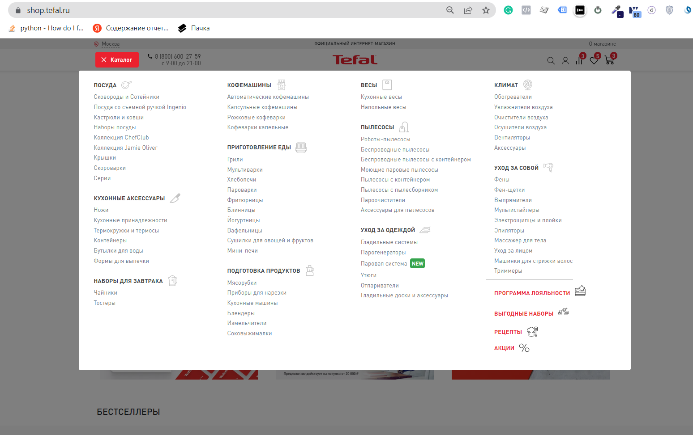

[Вернуться на главную](/README.md)

# **Карта рекомендованных событий общие**

<table>
	<tr>
        <th class="col1">№</th>
        <th class="col2">Событие</th>
        <th class="col3">Триггер (сценарий)</th>
        <th class="col4">Пример кода dataLayer</th>
        <th class="col5">Список страниц</th>
        <th class="col6">Место на странице </th>
        <th class="col7">Пример</th> 
    <!-- 1 Добавление товара в сравнение -->
       <tr>
        <td rowspan=2>1</td>
        <td rowspan=2>Добавление товара в сравнение</td>
        <td rowspan=2>Добавил товар в сравнение</td>
        <td rowspan=2><a href="../../02_datalayer_settings/01_events/02_interactions_events/01_addToCompare.md" target="_blank">01_addToCompare.md</a></td>
        <td rowspan=2>
            <li>Главная</li> 
            <li>Landing Page</li>
            <li>Страница с акциями</li>
            <li>Каталога товарных групп</li>
            <li>Каталога товаров</li>
            <li>Серия товаров</li>
            <li>Карточка товара</li>
            <li>Избранное</li>
            <li>Сравнение</li>
            <li>История покупок</li>
            <li>Страница история покупок</li>
            <li>Корзина</li>
            <li>Информационные</li>
        </td>
            <!---->
        <td>CMS ФИМ: виджет после добавления в корзину. </td>
        <td> Добавил товар в сравнение из списка товаров ниже добавленного товара </td>
            <!---->
        <tr>
        <td>AnyQuery: виджет на поиске</td>
        <td>  Добавил товар в сравнение из выдачи AnyQuery </td>   
        </tr>    
    <!-- 2 Добавление товара в избранное -->
       <tr>
        <td rowspan=2>2</td>
        <td rowspan=2>Добавление товара в избранное</td>
        <td rowspan=2>Добавил товар в избранное</td>
        <td rowspan=2><a href="../../02_datalayer_settings/01_events/02_interactions_events/02_addToWishList.md" target="_blank">02_addToWishList.md</a></td>
        <td rowspan=2>
            <li>Главная</li> 
            <li>Landing Page</li>
            <li>Страница с акциями</li>
            <li>Каталога товарных групп</li>
            <li>Каталога товаров</li>
            <li>Серия товаров</li>
            <li>Карточка товара</li>
            <li>Избранное</li>
            <li>Сравнение</li>
            <li>История покупок</li>
            <li>Страница история покупок</li>
            <li>Корзина</li>
            <li>Информационные</li>
        </td>
        <td>CMS ФИМ: виджет после добавления в корзину. </td>
        <td> Добавил товар в избранное из списка товаров ниже добавленного товара </td>
    </tr>
    <tr>
        <td>AnyQuery: виджет на поиске</td>
        <td>  Добавил товар в избранное из выдачи AnyQuery </td>  
    </tr>
        <!-- 3 Удаление из сравнения< -->
    <tr>
	    <td rowspan=2>3</td>
	    <td rowspan=2>Удаление из сравнения</td>
        <td rowspan=2>Удалил из сравнения</td>
        <td rowspan=2><a href="../../02_datalayer_settings/01_events/02_interactions_events/03_removeFromCompare.md" target="_blank">03_removeFromCompare.md</a></td>
        <td>
                    <li>Главная</li> 
                    <li>Landing Page</li>
                    <li>Страница с акциями</li>
                    <li>Каталога товарных групп</li>
                    <li>Каталога товаров</li>
                    <li>Серия товаров</li>
                    <li>Карточка товара</li>
                    <li>Избранное</li>
                    <li>Сравнение</li>
                    <li>История покупок</li>
                    <li>Страница история покупок</li>
                    <li>Корзина</li>
                    <li>Информационные</li>
        </td>
        <td>CMS ФИМ: виджет сравнение</td>
        <td>-------</td>
	</tr>
    <tr>
        <td>
                <li>Сравнение</li>
        </td>
        <td>CMS ФИМ: сайт</td>
        <td>-------</td>
    </tr>
        <!-- 4 Удаление из избранного< -->
    <tr>
	    <td rowspan=2>4</td>
	    <td rowspan=2>Удаление из избранного</td>
        <td rowspan=2>Удалил из избранного</td>
        <td rowspan=2><a href="../../02_datalayer_settings/01_events/02_interactions_events/04_removeFromWishList.md" target="_blank">04_removeFromWishList.md</a></td>
        <td>
                    <li>Главная</li> 
                    <li>Landing Page</li>
                    <li>Страница с акциями</li>
                    <li>Каталога товарных групп</li>
                    <li>Каталога товаров</li>
                    <li>Серия товаров</li>
                    <li>Карточка товара</li>
                    <li>Избранное</li>
                    <li>Сравнение</li>
                    <li>История покупок</li>
                    <li>Страница история покупок</li>
                    <li>Корзина</li>
                    <li>Информационные</li>
        </td>
        <td>CMS ФИМ: виджет избранное</td>
        <td>-------</td>
	</tr>
    <tr>
        <td>
                <li>Избранное</li>
        </td>
        <td>CMS ФИМ: сайт</td>
        <td>-------</td>
    </tr>   
    <!-- 20 Открытие формы авторизации -->
    <tr>
        <td>20</td>
        <td>Открытие формы авторизации</td>
        <td>Открытие формы авторизации</td>
        <td><a href="../../02_datalayer_settings/01_events/02_interactions_events/20_openLoginForm.md" target="_blank">20_openLoginForm.md</a></td>
        <td>
            <li>Главная</li> 
            <li>Landing Page</li>
            <li>Страница с акциями</li>
            <li>Каталога товарных групп</li>
            <li>Каталога товаров</li>
            <li>Серия товаров</li>
            <li>Карточка товара</li>
            <li>Избранное</li>
            <li>Сравнение</li>
            <li>История покупок</li>
            <li>Страница история покупок</li>
            <li>Корзина</li>
            <li>Информационные</li>
        </td>
        <td>CMS ФИМ: сайт</td>
        <td> ----------</td>
    </tr>      
    <!-- 21 Успешная авторизация на сайте -->
    <tr>
        <td>21</td>
        <td>Успешная авторизация на сайте</td>
        <td>Успешный ответ от сервера после подтверждение отправки формы авторизации</td>
        <td><a href="../../02_datalayer_settings/01_events/02_interactions_events/21_submitLoginForm.md" target="_blank">21_submitLoginForm.md</a></td>
        <td>
            <li>Главная</li> 
            <li>Landing Page</li>
            <li>Страница с акциями</li>
            <li>Каталога товарных групп</li>
            <li>Каталога товаров</li>
            <li>Серия товаров</li>
            <li>Карточка товара</li>
            <li>Избранное</li>
            <li>Сравнение</li>
            <li>История покупок</li>
            <li>Страница история покупок</li>
            <li>Корзина</li>
            <li>Информационные</li>
        </td>
        <td>CMS ФИМ: сайт</td>
        <td> После успешной авторизации появляется иконка на хедере</td>
    </tr>
    <!-- 22 Открытие формы регистрации -->
    <tr>
        <td>22</td>
        <td>Открытие формы регистрации</td>
        <td>Открытие формы регистрации</td>
        <td><a href="../../02_datalayer_settings/01_events/02_interactions_events/22_openRegisterForm.md" target="_blank">22_openRegisterForm.md</a></td>
        <td>
            <li>Главная</li> 
            <li>Landing Page</li>
            <li>Страница с акциями</li>
            <li>Каталога товарных групп</li>
            <li>Каталога товаров</li>
            <li>Серия товаров</li>
            <li>Карточка товара</li>
            <li>Избранное</li>
            <li>Сравнение</li>
            <li>История покупок</li>
            <li>Страница история покупок</li>
            <li>Корзина</li>
            <li>Информационные</li>
        </td>
        <td>CMS ФИМ: сайт</td>
        <td> ----------</td>
    </tr> 
    <!-- 28 Добавил товар из PopUp в корзине (в Pop Up выходит после нажатия на кпопку Оформить заказ) -->
    <tr>
        <td>28</td>
        <td>Добавил товар из PopUp в корзине (в Pop Up выходит после нажатия на кпопку Оформить заказ)</td>
        <td>Добавил товар из PopUp в корзине (в Pop Up выходит после нажатия на кпопку Оформить заказ)</td>
        <td><a href="../../02_datalayer_settings/01_events/02_interactions_events/28_clickCartPopUpAccepted.md" target="_blank">28_clickCartPopUpAccepted.md</a></td>
        <td>
            <li>Корзина</li>
        </td>
        <td>CMS ФИМ: сайт</td>
        <td> ----------</td>
    </tr>
    <!-- 29 Клик на кнопку "Не интересует" на PopUp в корзине (в Pop Up выходит после нажатия на кпопку Оформить заказ) -->
    <tr>
        <td>29</td>
        <td>Клик на кнопку "Не интересует" на PopUp в корзине (в Pop Up выходит после нажатия на кпопку Оформить заказ)</td>
        <td>Клик на кнопку "Не интересует" на PopUp в корзине (в Pop Up выходит после нажатия на кпопку Оформить заказ)</td>
        <td><a href="../../02_datalayer_settings/01_events/02_interactions_events/29_clickCartPopUpRejected.md" target="_blank">29_clickCartPopUpRejected.md</a></td>
        <td>
            <li>Корзина</li>
        </td>
        <td>CMS ФИМ: сайт</td>
        <td> ----------</td>
    </tr>
    <!-- 30 Закрыть PopUp в корзине (в Pop Up выходит после нажатия на кпопку Оформить заказ) -->
    <tr>
        <td>30</td>
        <td>Закрыть PopUp в корзине (в Pop Up выходит после нажатия на кпопку Оформить заказ)</td>
        <td>Закрыть PopUp в корзине (в Pop Up выходит после нажатия на кпопку Оформить заказ)</td>
        <td><a href="../../02_datalayer_settings/01_events/02_interactions_events/30_closeCartPopUp.md" target="_blank">30_closeCartPopUp.md</a></td>
        <td>
            <li>Корзина</li>
        </td>
        <td>CMS ФИМ: сайт</td>
        <td> ----------</td>
    </tr>
    <!-- 31 Клик на кнопку "Больше не показывать такие предложения" на PopUp в корзине (в Pop Up выходит после нажатия на кпопку Оформить заказ) -->
    <tr>
        <td>31</td>
        <td>Клик на кнопку "Больше не показывать такие предложения" на PopUp в корзине (в Pop Up выходит после нажатия на кпопку Оформить заказ)</td>
        <td>Клик на кнопку "Больше не показывать такие предложения" на PopUp в корзине (в Pop Up выходит после нажатия на кпопку Оформить заказ)</td>
        <td><a href="../../02_datalayer_settings/01_events/02_interactions_events/31_clickCartPopUpNeverShowAgain.md" target="_blank">31_clickCartPopUpNeverShowAgain.md</a></td>
        <td>
            <li>Корзина</li>
        </td>
        <td>CMS ФИМ: сайт</td>
        <td> ----------</td>
    </tr>
    <!-- 32 Заполнение в форме аторизации поля email или телефон -->
    <tr>
        <td>32</td>
        <td>Заполнение в форме аторизации поля email или телефон</td>
        <td>Заполнение в форме аторизации поля email или телефон</td>
        <td><a href="../../02_datalayer_settings/01_events/02_interactions_events/32_fillLoginFormContacts.md" target="_blank">32_fillLoginFormContacts.md</a></td>
        <td>
            <li>Главная</li> 
            <li>Landing Page</li>
            <li>Страница с акциями</li>
            <li>Каталога товарных групп</li>
            <li>Каталога товаров</li>
            <li>Серия товаров</li>
            <li>Карточка товара</li>
            <li>Избранное</li>
            <li>Сравнение</li>
            <li>История покупок</li>
            <li>Страница история покупок</li>
            <li>Корзина</li>
            <li>Информационные</li>
        </td>
        <td>CMS ФИМ: сайт</td>
        <td> - </td>
    </tr>
        <!-- 33 Заполнение в форме аторизации поля пароль -->
    <tr>
        <td>33</td>
        <td>Заполнение в форме аторизации поля пароль</td>
        <td>Заполнение в форме аторизации поля пароль</td>
        <td><a href="../../02_datalayer_settings/01_events/02_interactions_events/33_fillLoginFormPassword.md" target="_blank">33_fillLoginFormPassword.md</a></td>
        <td>
            <li>Главная</li> 
            <li>Landing Page</li>
            <li>Страница с акциями</li>
            <li>Каталога товарных групп</li>
            <li>Каталога товаров</li>
            <li>Серия товаров</li>
            <li>Карточка товара</li>
            <li>Избранное</li>
            <li>Сравнение</li>
            <li>История покупок</li>
            <li>Страница история покупок</li>
            <li>Корзина</li>
            <li>Информационные</li>
        </td>
        <td>CMS ФИМ: сайт</td>
        <td> ----------</td>
    </tr> 
    <!-- 34 Закрытие формы авторизации -->
    <tr>
        <td>34</td>
        <td>Закрытие формы авторизации</td>
        <td>Закрытие формы авторизации</td>
        <td><a href="../../02_datalayer_settings/01_events/02_interactions_events/34_closeLoginForm.md" target="_blank">34_closeLoginForm.md</a></td>
        <td>
            <li>Главная</li> 
            <li>Landing Page</li>
            <li>Страница с акциями</li>
            <li>Каталога товарных групп</li>
            <li>Каталога товаров</li>
            <li>Серия товаров</li>
            <li>Карточка товара</li>
            <li>Избранное</li>
            <li>Сравнение</li>
            <li>История покупок</li>
            <li>Страница история покупок</li>
            <li>Корзина</li>
            <li>Информационные</li>
        </td>
        <td>CMS ФИМ: сайт</td>
        <td> ----------</td>
    </tr> 
        <!-- 35 Клик по кнопке войти по СМС -->
    <tr>
        <td>35</td>
        <td>Клик по кнопке войти по СМС</td>
        <td>Клик по кнопке войти по СМС</td>
        <td><a href="../../02_datalayer_settings/01_events/02_interactions_events/35_clickLoginFormBySMSOrPassword.md" target="_blank">35_clickLoginFormBySMSOrPassword.md</a></td>
        <td>
            <li>Главная</li> 
            <li>Landing Page</li>
            <li>Страница с акциями</li>
            <li>Каталога товарных групп</li>
            <li>Каталога товаров</li>
            <li>Серия товаров</li>
            <li>Карточка товара</li>
            <li>Избранное</li>
            <li>Сравнение</li>
            <li>История покупок</li>
            <li>Страница история покупок</li>
            <li>Корзина</li>
            <li>Информационные</li>
        </td>
        <td>CMS ФИМ: сайт</td>
        <td> ----------</td>
    </tr> 
        <!-- 36 Клик по кнопке войти по кнопке Забыли пароль -->
    <tr>
        <td>36</td>
        <td>Клик по кнопке войти по кнопке Забыли пароль</td>
        <td>Клик по кнопке войти по кнопке Забыли пароль</td>
        <td><a href="../../02_datalayer_settings/01_events/02_interactions_events/36_clickLoginFormForgotPassword.md" target="_blank">36_clickLoginFormForgotPassword.md</a></td>
        <td>
            <li>Главная</li> 
            <li>Landing Page</li>
            <li>Страница с акциями</li>
            <li>Каталога товарных групп</li>
            <li>Каталога товаров</li>
            <li>Серия товаров</li>
            <li>Карточка товара</li>
            <li>Избранное</li>
            <li>Сравнение</li>
            <li>История покупок</li>
            <li>Страница история покупок</li>
            <li>Корзина</li>
            <li>Информационные</li>
        </td>
        <td>CMS ФИМ: сайт</td>
        <td> ----------</td>
    </tr> 
        <!-- 37 Закрытие формы регистрации -->
    <tr>
        <td>37</td>
        <td>Закрытие формы регистрации</td>
        <td>Закрытие формы регистрации</td>
        <td><a href="../../02_datalayer_settings/01_events/02_interactions_events/37_closeRegisterForm.md" target="_blank">37_closeRegisterForm.md</a></td>
        <td>
            <li>Главная</li> 
            <li>Landing Page</li>
            <li>Страница с акциями</li>
            <li>Каталога товарных групп</li>
            <li>Каталога товаров</li>
            <li>Серия товаров</li>
            <li>Карточка товара</li>
            <li>Избранное</li>
            <li>Сравнение</li>
            <li>История покупок</li>
            <li>Страница история покупок</li>
            <li>Корзина</li>
            <li>Информационные</li>
        </td>
        <td>CMS ФИМ: сайт</td>
        <td> ----------</td>
    </tr> 
        <!-- 38 Заполнение полей в форме регистрации -->
    <tr>
        <td>38</td>
        <td>Заполнение полей в форме регистрации</td>
        <td>Заполнение полей в форме регистрации</td>
        <td><a href="../../02_datalayer_settings/01_events/02_interactions_events/38_fillRegisterFormItems.md" target="_blank">38_fillRegisterFormItems.md</a></td>
        <td>
            <li>Главная</li> 
            <li>Landing Page</li>
            <li>Страница с акциями</li>
            <li>Каталога товарных групп</li>
            <li>Каталога товаров</li>
            <li>Серия товаров</li>
            <li>Карточка товара</li>
            <li>Избранное</li>
            <li>Сравнение</li>
            <li>История покупок</li>
            <li>Страница история покупок</li>
            <li>Корзина</li>
            <li>Информационные</li>
        </td>
        <td>CMS ФИМ: сайт</td>
        <td> ----------</td>
    </tr> 
   <!-- 39 Успешная регистрация на сайте -->
    <tr>
        <td>39</td>
        <td>Ответ от сервера после подтверждение отправки формы регистрации</td>
        <td>Успешный ответ от сервера после подтверждение отправки формы регистрации</td>
        <td><a href="../../02_datalayer_settings/01_events/02_interactions_events/39_submitRegisterForm.md" target="_blank">39_submitRegisterForm.md</a></td>
        <td>
            <li>Главная</li> 
            <li>Landing Page</li>
            <li>Страница с акциями</li>
            <li>Каталога товарных групп</li>
            <li>Каталога товаров</li>
            <li>Серия товаров</li>
            <li>Карточка товара</li>
            <li>Избранное</li>
            <li>Сравнение</li>
            <li>История покупок</li>
            <li>Страница история покупок</li>
            <li>Корзина</li>
            <li>Информационные</li>
        </td>
        <td>CMS ФИМ: сайт</td>
        <td> - </td>
    </tr>
    <!-- 40 Ответ сервера после отправки сброс пароля -->
    <tr>
        <td>40</td>
        <td>Ответ сервера после отправки сброс пароля</td>
        <td>Ответ сервера после отправки сброс пароля</td>
        <td><a href="../../02_datalayer_settings/01_events/02_interactions_events/40_submitResetPassword.md" target="_blank">40_submitResetPassword.md</a></td>
        <td>
            <li>Главная</li> 
            <li>Landing Page</li>
            <li>Страница с акциями</li>
            <li>Каталога товарных групп</li>
            <li>Каталога товаров</li>
            <li>Серия товаров</li>
            <li>Карточка товара</li>
            <li>Избранное</li>
            <li>Сравнение</li>
            <li>История покупок</li>
            <li>Страница история покупок</li>
            <li>Корзина</li>
            <li>Информационные</li>
        </td>
        <td>CMS ФИМ: сайт</td>
        <td> - </td>
    </tr>
        <!-- 41 Cрабатывает всегда при смене слайда -->
    <tr>
        <td>41</td>
        <td>Cрабатывает всегда при смене слайда</td>
        <td>Cрабатывает всегда при смене слайда</td>
        <td><a href="../../02_datalayer_settings/01_events/02_interactions_events/41_sliderSlideChange.md" target="_blank">41_sliderSlideChange.md</a></td>
        <td>
            <li>Карточка товара</li>
        </td>
        <td>CMS ФИМ: сайт</td>
        <td> - </td>
    </tr>
    <!-- 42 Cрабатывает всегда при смене слайда (маленький слайдер) -->
    <tr>
        <td>42</td>
        <td>Cрабатывает всегда при смене слайда (маленький слайдер)</td>
        <td>Cрабатывает всегда при смене слайда (маленький слайдер)</td>
        <td><a href="../../02_datalayer_settings/01_events/02_interactions_events/42_thumbSlideChange.md" target="_blank">42_thumbSlideChange.md</a></td>
        <td>
            <li>Карточка товара</li>
        </td>
        <td>CMS ФИМ: сайт</td>
        <td> - </td>
    </tr>
    <!-- 43 Клик по стрелке -->
    <tr>
        <td>43</td>
        <td>Клик по стрелке</td>
        <td>Клик по стрелке</td>
        <td><a href="../../02_datalayer_settings/01_events/02_interactions_events/43_sliderArrowClick.md" target="_blank">43_sliderArrowClick.md</a></td>
        <td>
            <li>Карточка товара</li>
        </td>
        <td>CMS ФИМ: сайт</td>
        <td> - </td>
    </tr>
    <!-- 44 Клик по стрелке (маленький слайдер) -->
    <tr>
        <td>44</td>
        <td>Клик по стрелке (маленький слайдер)</td>
        <td>Клик по стрелке (маленький слайдер)</td>
        <td><a href="../../02_datalayer_settings/01_events/02_interactions_events/44_thumbArrowClick.md" target="_blank">44_thumbArrowClick.md</a></td>
        <td>
            <li>Карточка товара</li>
        </td>
        <td>CMS ФИМ: сайт</td>
        <td> - </td>
    </tr>
    <!-- 45 Клик по слайду (маленький слайдер) -->
    <tr>
        <td>45</td>
        <td>Клик по слайду (маленький слайдер)</td>
        <td>Клик по слайду (маленький слайдер)</td>
        <td><a href="../../02_datalayer_settings/01_events/02_interactions_events/45_thumbImageClick.md" target="_blank">45_thumbImageClick.md</a></td>
        <td>
            <li>Карточка товара</li>
        </td>
        <td>CMS ФИМ: сайт</td>
        <td> - </td>
    </tr>
       <!-- 46 Закрыл предпросмотр баннера на главной странице -->
    <tr>
        <td>46</td>
        <td>Закрыл предпросмотр баннера на главной странице</td>
        <td>Закрыл предпросмотр баннера на главной странице</td>
        <td><a href="../../02_datalayer_settings/01_events/02_interactions_events/46_closeBannerPreview.md" target="_blank">46_closeBannerPreview.md</a></td>
        <td>
            <li>Главная</li>
        </td>
        <td>CMS ФИМ: сайт</td>
        <td> - </td>
    </tr>
    <!-- 55555 Взаимодействие с меню -->
    <tr>
        <td>55555</td>
        <td>Взаимодейтсвие с меню</td>
        <td>Выбрал пункт в меню</td>
        <td></td>
        <td>
            <li>Главная</li> 
            <li>Landing Page</li>
            <li>Страница с акциями</li>
            <li>Каталога товарных групп</li>
            <li>Каталога товаров</li>
            <li>Серия товаров</li>
            <li>Карточка товара</li>
            <li>Избранное</li>
            <li>Сравнение</li>
            <li>История покупок</li>
            <li>Страница история покупок</li>
            <li>Корзина</li>
            <li>Информационные</li>
        </td>
        <td>CMS ФИМ: сайт</td>
        <td></td>
    </tr>
    <!-- 666666 Подписался на рассылку -->
    <tr>
        <td>666666</td>
        <td>Подписался на рассылку</td>
        <td>Успешно подписался на рассылку</td>
        <td></td>
        <td>
            <li>-</li>
        </td>
        <td>-</td>
        <td>-</td>
    </tr>
</table>  