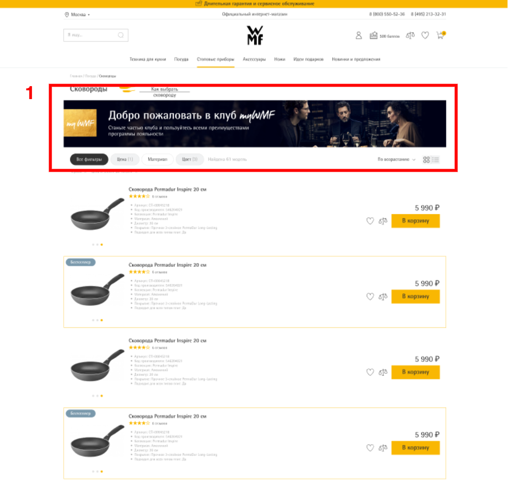

# **Типы баннеров**
## **Места для баннеров на главной странице**

|№  | Описание                      | Значение DataLayer |
|:--| :-----------                  | :------------------|
|1  | Слайдер главный               | headerSlider       |
|2  | Сезонные предложения          | seasonalOffers     |
|3  | Преимущества                  | advantages         |
|4  | Как сделать правильный выбор  | makeTheRightChoice |
|5  | Баннер внизу                  | footerBanner       |

***
## **Места для баннеров на странице каталога товарных групп**

|№  | Описание            | Значение DataLayer |
|:--| :---------------    | :------------------|
|1  | Баннер главный      | headerSlider       |

***
## **Места для баннеров на странице каталога**

|№  | Описание            | Значение DataLayer |
|:--| :---------------    | :------------------|
|1  | Баннер главный      | headerSlider       |

***
## **Места для баннеров на странице карточки товара**

|№  | Описание            | Значение DataLayer |
|:--| :---------------    | :------------------|
|1  | Баннер справа       | rightBanner        |
|2  | Баннер внизу        | footerBanner       |

***
## **Места для баннеров в корзине**

|№  | Описание            | Значение DataLayer |
|:--| :---------------    | :------------------|
|1  | Баннер внизу        | footerBanner       |
***